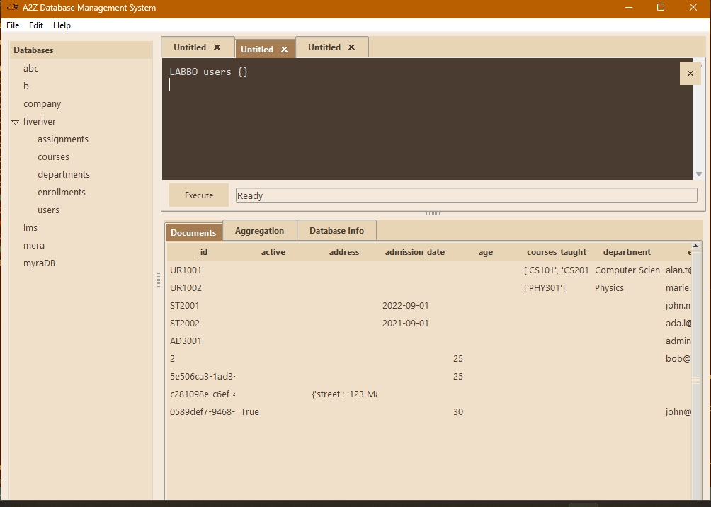
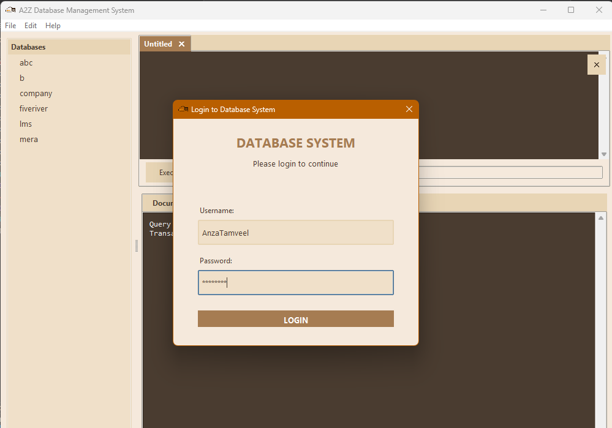
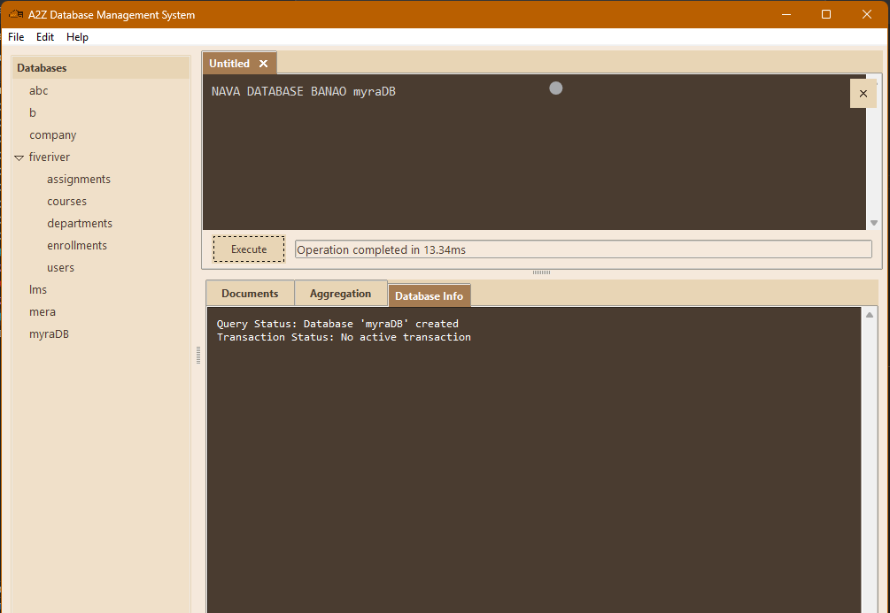
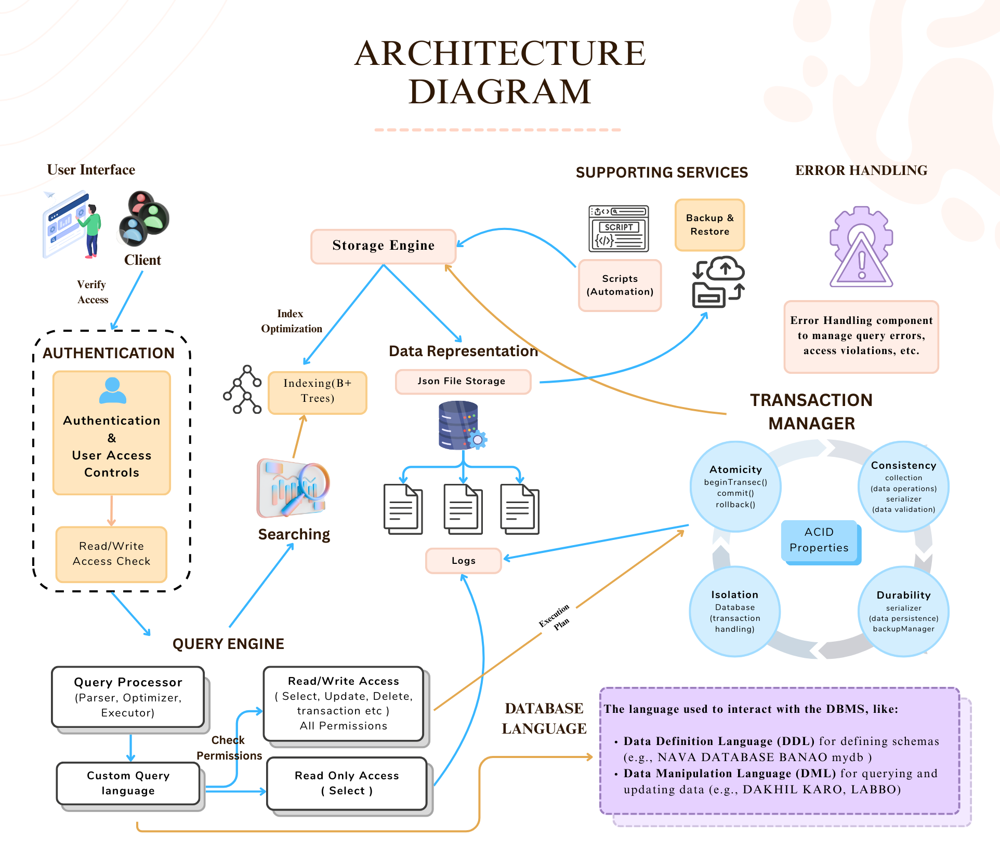

# A2Z Database Management System

**Course Code:** CSC-207 - Advance Database Management System  
**Project Type:** Semester Project  
**Institute:** University of Engineering and Technology, Lahore  
**Semester:** Spring 2025  

---

## 🔰 Project Overview

**A2Z Database Management System** is a lightweight, modular DBMS designed from scratch using Python. It includes a Tkinter-based GUI and supports a custom query language to perform all database operations without relying on SQL or MongoDB. The system supports user roles, authentication, transaction control, and data backup.

---

## 👥 Project Members

| Name            | Roll No       |
|-----------------|---------------|
| Anza Tamveel    | 2023-CS-87    |
| Amna Atiq       | 2023-CS-83    |
| Zainab Batool   | 2023-CS-89    |

---

## 🧠 Features

- 🔐 Role-based authentication system
- 📜 Custom-built query language
- 🧩 Modular and extensible architecture
- 🧮 Support for database, collections, insert, update, delete, read
- 💾 Serialization and backup manager
- 🔄 Transaction management and rollback
- 🖥️ Tkinter-based GUI for ease of use
- 📝 Integrated logging system for audit and debugging

---

## 📁 Project Structure

```
DB_task/
├── __init__.py
├── main.py                # Entry point
├── core/
│   ├── __init__.py
│   ├── database.py        # Database operations
│   ├── collection.py      # Collection management
│   ├── query.py           # Query execution
│   ├── serializer.py      # Data serialization
│   ├── permission.py      # Permissions
│   ├── decorator.py       # Authentication decorators
│   ├── auth.py            # User authentication
│   └── backup_manager.py  # Backup/restore
├── gui/
│   ├── __init__.py
│   ├── main_window.py     # Main GUI
│   └── dialogs.py         # Dialog windows
├── utils/
│   ├── __init__.py
│   ├── helpers.py         # Utilities
│   └── loggers.py         # Logging
├── logs/                  # Operation logs
├── db/                    # Auto-created storage
│   └── auth/
│       └── users.json     # Credentials
├── WireFrames/            # Architecture diagrams & UI wireframes
│   ├── Architecture.png
│   ├── Login_UI.png
│   └── Dashboard_UI.png
├── icon.png               # App icon
└── README.md              # This file
```

---

## 💡 Custom Query Language

A2Z DBMS includes its own query language to replace SQL-style syntax with simpler readable commands.

### Sample Commands:

```plaintext
-- Create a new database
NAVA DATABASE BANAO mydb

-- Switch to database
DATABASE CHALAO mydb

-- Create collections
NAVA COLLECTION BANAO users

-- Insert single document
DAKHIL KARO users {"name": "John", "age": 30, "email": "john@example.com", "active": true}

-- Insert multiple documents
DAKHIL KARO users [{"name": "Alice", "age": 25}, {"name": "Bob", "age": 35}]

-- Find documents (without index)
LABBO users {"age": {"$gt": 25}}

-- Update document
BADLO users {"name": "John"} {"$set": {"age": 31}}

-- Delete document
MITAO users {"name": "Bob"}

-- First find without index (note the time)
LABBO users {"age": {"$gt": 25}}
```

---

## 🖼️ Wireframes and Architecture

All UI wireframes and architectural diagrams are stored in the `WireFrames/` folder.

  
  
  


---

## 🚀 Getting Started

### Requirements:

- Python 3.10+
- Tkinter (usually preinstalled)

### Run the Application:

```bash
python main.py
```

---

## 🔐 Authentication Format

User credentials are stored in `db/auth/users.json` as hashed passwords.

```json
{
  "admin": {
    "password_hash": "240be518fabd2724ddb6f04eeb1da5967448d7e831c08c8fa822809f74c720a9",
    "roles": ["admin"]
  }
}
```

Use SHA256 to hash new passwords before inserting them manually.

---

## 📃 License

This project is developed as a final project for CSC-207 - Advanced DBMS.  
All rights reserved ©️ 2025 - Anza Tamveel, Amna Atiq, Zainab Batool.
